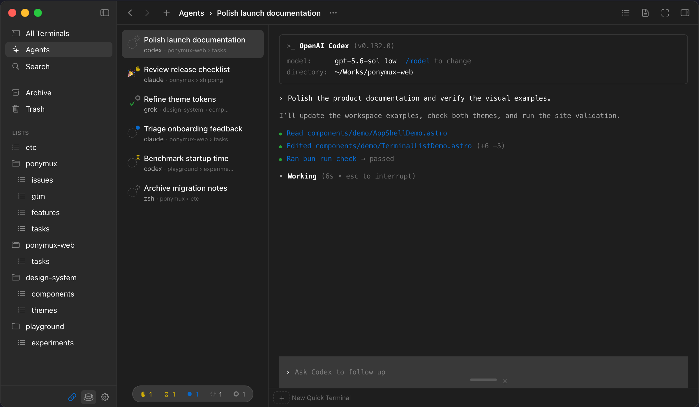

# PonyMux

## Organize terminal work like notes.

A native Mac terminal that keeps your Claude Code, Codex, and Grok sessions organized — lists, folders, persistent history, and one focused terminal at a time.

Workspace demo with sample tasks. [Try the interactive demo →](https://ponymux.com/)

### A workspace you can browse

Lists, Folders, manual order, Archive, and Trash give long-lived work a familiar place to live. Find a Terminal by what it means, not by which window happened to contain it. Stamp reactions to mark progress — ✓ done, 🎉 shipped, ⏸ paused. Filter by agent status. Resume or fork any past session.

[See how organization works →](https://ponymux.com/docs/organize)

### One task gets the screen. The rest stay ready.

Your other sessions keep running — status and notifications bring you back when something needs attention.

[Explore the workspace →](https://ponymux.com/docs/workspace-navigation)

### Search terminals and conversations.

Press `⌘K` to find a Terminal by name, or search the full text of every conversation you've had with Claude Code, Codex, and Grok. Scope pills narrow results to Terminals, Archive, or Transcripts. Select a transcript match and the conversation appears with your search terms highlighted — resume directly from there.

[Explore search →](https://ponymux.com/docs/search)

### Works with Claude Code, Codex, and Grok.

Connect each provider you use for live agent status, notifications, session history, Resume and Fork. The agents keep their own terminal interfaces — PonyMux just improves the surroundings.

[Explore agent integrations →](https://ponymux.com/docs/integrations)

### Themes you can feel.

10+ themes applied in one click. Cursor effects, Metal shaders, and reactions make the workspace feel yours.

[Explore personalization →](https://ponymux.com/docs/personalize)

### 15 MB. Opens before you blink.

No Electron, no bundled browser. A native Swift app with a [Ghostty-powered terminal](https://github.com/ghostty-org/ghostty) — built to stay open all day.

## Try it with your next task

1. [Download PonyMux](https://ponymux.com/download?utm_source=github&utm_medium=readme), open the DMG, and drag the app to Applications.
2. Launch PonyMux and connect Claude Code, Codex, or Grok through **Agent Integrations** at the bottom of the sidebar. Install your preferred agent separately if you do not already use it.
3. Create a Terminal with `⌘N` and run `claude`, `codex`, or `grok`. Start another task in a second Terminal and switch between them as they need you.

The app is signed with Developer ID and notarized by Apple, with updates available in the app.

[Read the setup guide →](https://ponymux.com/docs/getting-started)

## Help shape PonyMux

Something getting in your way? Use [GitHub Issues](https://github.com/heylittlepan/ponymux/issues) to report a bug or tell us what you wish were easier. Search existing reports first, and add your experience if someone has already reported it.

For log collection and private reporting, see [Support](SUPPORT.md). Remove sensitive information before sharing logs or screenshots.

[Recent updates](CHANGELOG.md) · [Blog](https://ponymux.com/blog) · [Follow @ponymux](https://x.com/ponymux)

## About this repository

PonyMux is free to download and proprietary. This repository hosts its product introduction, release summaries, and public feedback. The application source code is not included. See [LICENSE.md](LICENSE.md).
